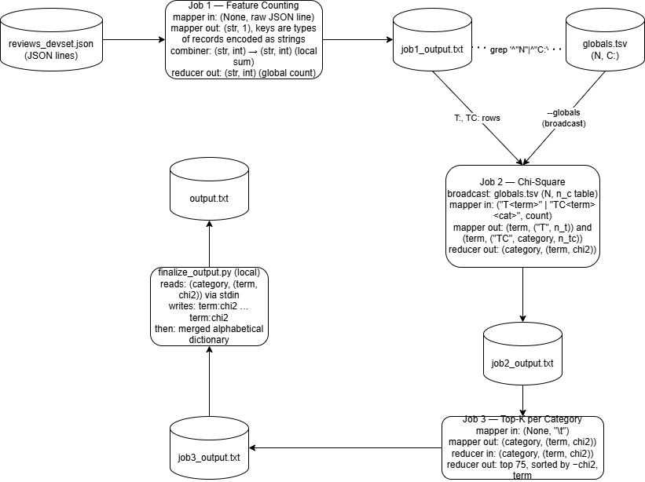

# Assignment 1 — Chi-Square Term Selection with MapReduce

```
Contributors:

Hassan Ali
Odedra Mayurbhai Jakharabhai
Petho Dominik
Robea Anda-Teodora
Rusu Paisie
```
## 1. Introduction

Text classification relies on features that discriminate well between
classes. For the Amazon Review Dataset (22 product categories, up to 56 GB
in the full corpus), we select such features by computing the chi-square
statistic for every (term, category) pair, keeping the top 75 most
discriminative terms per category, and merging all surviving terms into a
single dictionary.

The computation is embarrassingly parallel at the document level but
requires a global view of corpus-wide counts, so a naive single-machine
implementation does not scale. We therefore cast it as a small MapReduce
pipeline (three Hadoop jobs plus a final local formatter), implemented in
Python using the `mrjob` framework. The pipeline is orchestrated by
`run.sh`, which takes an optional input path so the same code runs on
both the development sample and the full dataset on HDFS.

## 2. Problem Overview

For each term `t` and category `c`, the chi-square statistic measures how
strongly the presence of `t` in a document deviates from what one would
expect under the independence hypothesis between terms and categories. It
is computed from the 2×2 contingency table of document counts:

```
            in category c    not in category c
contains t      A = n_tc        B = n_t − n_tc
no t            C = n_c − n_tc  D = N − n_t − n_c + n_tc
```

with

```
chi2(t, c) = N · (A·D − B·C)² / ((A+B)(C+D)(A+C)(B+D))
```

Computing this for every `(t, c)` pair requires four kinds of counts:

- `N` — total documents in the corpus,
- `n_c` — documents in category `c` (22 numbers total),
- `n_t` — documents containing term `t`,
- `n_tc` — documents in category `c` containing term `t`.

The **required output** is a file `output.txt` with

- one line per category, in alphabetical order:
  `<category> term_1:chi2 term_2:chi2 … term_75:chi2`
  (terms in descending chi-square),
- one final line containing every surviving term, space-separated and
  alphabetically sorted.

The **required preprocessing** (applied to `reviewText` only): case
folding; tokenization using whitespace, tabs, digits, and the delimiter
set ``()[]{}.!?,;:+=-_"'`~#@&*%€$§\/``; stopword filtering using the
supplied `stopwords.txt`; removal of tokens of length ≤ 1; deduplication
per document so counts reflect document presence rather than raw
frequency.

The key challenges are (i) keeping the distributed join between
term-level and category-level counts cheap, (ii) avoiding unnecessary
I/O on the full 56 GB input, and (iii) keeping the top-K selection
deterministic under parallel execution.

## 3. Methodology and Approach

### 3.1 Pipeline overview

The pipeline runs three MapReduce jobs followed by a single local
formatting step. Figure 1 shows the data flow and the concrete
`<key, value>` types at every stage.

**Figure 1 — pipeline and `<key, value>` design.**



Source: `pipeline.dot` (rendered to PDF/PNG with
`dot -Tpdf pipeline.dot -o pipeline.pdf`).

### 3.2 Preprocessing module (`utils/text_processing.py`)

Preprocessing is isolated in one module so every job applies identical
logic. The main steps are:

1. `tokenize_review_text` — case-fold the `reviewText` field and split it
   on the assignment's delimiter characters.
2. `preprocess_review_text` — drop tokens of length ≤ 1, drop stopwords,
   and deduplicate the remaining tokens per document while preserving
   first-seen order.
3. `preprocess_review_record` — apply the pipeline to a JSON record and
   guarantee only `reviewText` is used.

The stopword set is loaded once per worker to avoid
repeated file I/O across millions of records.

### 3.3 Job 1 — Feature counting (`job1_counts.py`)

Purpose: emit every count that Job 2 will need, in a single pass over the
input.

| Stage        | Key                                              | Value            |
|--------------|--------------------------------------------------|------------------|
| mapper in    | raw JSON line (via `RawValueProtocol`)           | —                |
| mapper out   | `"N"` / `"C:<cat>"` / `"T:<term>"` / `"TC:<term>:<cat>"` | `1`       |
| combiner     | same as mapper-out key                           | `int` (local sum)|
| reducer out  | same key                                         | `int` (total sum)|

Emitting document-level keys (after per-document deduplication) gives us
all four count types from a single scan. The combiner collapses the 1s
before the shuffle, which is critical at 56 GB scale where common terms
would otherwise dominate the shuffle bandwidth.

### 3.4 Extracting the broadcast side (`grep`)

`N` and the 22 `C:<cat>` rows are tiny (23 integers). A one-line
`grep -E '^"N"|^"C:'` extracts them into `globals.tsv` so Job 2 can load
them as an in-memory lookup table on every worker, avoiding a second
shuffle for corpus-level counts.

### 3.5 Job 2 — Chi-square (`job2_chi2.py`)

Purpose: join per-term and per-(term, category) counts with the
broadcast globals and emit chi-square scores.

| Stage        | Key                                              | Value                                        |
|--------------|--------------------------------------------------|----------------------------------------------|
| mapper in    | `"T:<term>"` / `"TC:<term>:<cat>"` (`JSONProtocol`) | `int`                                     |
| mapper out   | `<term>`                                           | `("T", n_t)` or `("TC", category, n_tc)`     |
| reducer init | — loads `globals.tsv` (N and n_c table)          | —                                            |
| reducer out  | `category`                                       | `(term, chi2)`                               |

The mapper **re-keys by term** so that, after the shuffle, each reducer
task receives one `T` row plus one `TC` row per category the term
appears in (≤ 23 values per term, so no skew). The reducer then applies
the chi-square formula directly, using the broadcast `N` and `n_c`
values. Emission is keyed by **category**, which is exactly the grouping
Job 3 needs — no further reshuffling is required.

Rows of type `"N"` and `"C:…"` are dropped at map time because the same
information is already available on every worker via the broadcast.

### 3.6 Job 3 — Top-K per category (`job3_topk.py`)

Purpose: for each category, retain only the 75 highest-scoring terms.

| Stage        | Key                                              | Value                       |
|--------------|--------------------------------------------------|-----------------------------|
| mapper in    |  `category (term, chi2) `                | —                           |
| mapper out   | `category`                                       | `(term, chi2)`              |
| reducer out  | `category`                                       | `(term, chi2)` (top 75)     |

The reducer sorts the values by `(−chi2, term)` — ties are broken
alphabetically for determinism — and slices the first 75. Output volume
is capped at `75 × |categories|` rows, which trivially fits on a single
machine and makes the final formatting step cheap.

### 3.7 Finalizer (`finalize_output.py`)

The output of Job 3 is already tiny, so the last formatting step runs as
a plain Python script over `stdin`:

1. Parse each tab-separated `<jcat>\t[term, chi2]` line into a
   `(category, term, chi2)` triple.
2. Accumulate per-category term lists and a global term set.
3. Emit one line per category (alphabetical), each term as
   `term:chi2`, followed by a single line listing every surviving term
   sorted alphabetically.

Making this a plain local step rather than a MapReduce job avoids
scheduling overhead for work that has no parallelism left to exploit.

### 3.8 Efficiency choices

- **One pass over the raw input.** Job 1 extracts all four count types
  simultaneously; the full 56 GB file is never read twice.
- **Document-level deduplication.** Because chi-square is defined on
  document counts, deduplicating inside the mapper avoids over-counting
  and shrinks the combiner/shuffle volume.
- **Combiner in Job 1.** Reduces the shuffle volume for common terms by
  orders of magnitude.
- **Broadcast join for globals.** Keeps Job 2 a single MapReduce stage
  instead of requiring a second shuffle to bring `N`/`n_c` together
  with term counts.
- **No combiner in Job 2 / Job 3.** Mapper output there is already
  unique per key, so a combiner would have nothing to collapse.
- **Deterministic tie-breaking.** Top-K uses `(−chi2, term)` so results
  are reproducible across runs and machines.

## 4. Conclusions

The pipeline computes per-category chi-square term selection in three
MapReduce passes plus a trivial local format step. The key design
choices — emitting all four count families in one Job 1 pass, using a
broadcast side file for the 23 globals, re-keying by term for the join
in Job 2, and keying Job 2's output by category so Job 3 needs no
additional shuffle — together yield a pipeline whose shuffle volume is
dominated by the per-term count stream and nothing else.

The implementation is small (≈ 300 LOC including preprocessing),
isolated per stage (easy to debug and test), and parameterized through
`run.sh` so the same code runs on the local devset and the full HDFS
dataset. Correctness is enforced by shared preprocessing, deterministic
tie-breaking, and defensive handling of degenerate contingency tables.
The structure runs in around 20 minutes on the full 56 GB input, since each job either scans the data
once (Job 1), processes a single shuffle of per-term counts (Job 2), or
works on a data set already reduced to thousands of rows (Job 3 and
finalizer).
